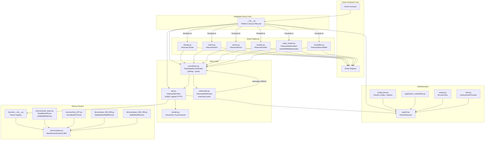
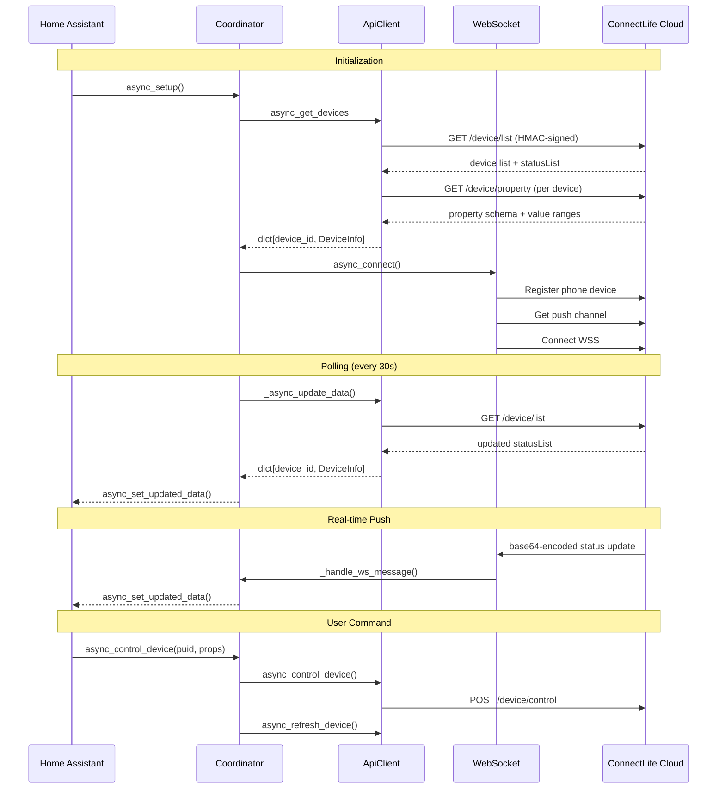
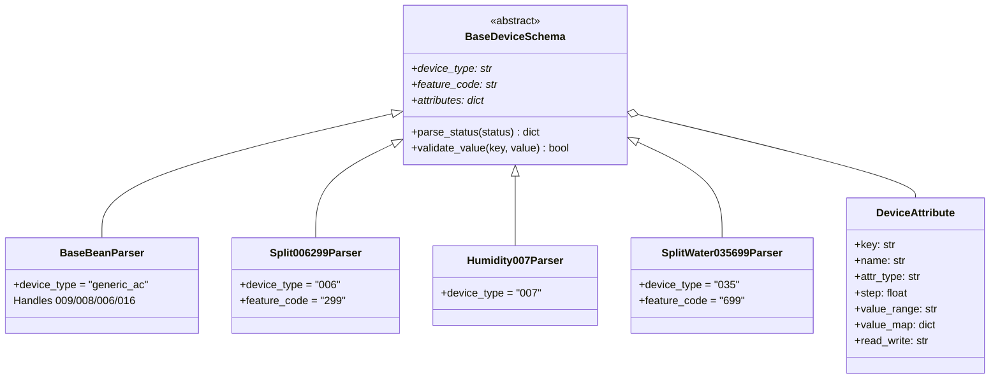

# Hisense ConnectLife Integration for Home Assistant

Custom integration for controlling Hisense/ConnectLife appliances via the ConnectLife cloud API.

## Supported Devices

| Type Code | Description                  | Platform(s)                  |
| --------- | ---------------------------- | ---------------------------- |
| `009`     | Split AC                     | Climate, Switch, Sensor      |
| `008`     | Window AC                    | Climate, Switch, Sensor      |
| `006`     | Portable AC                  | Climate, Switch, Sensor      |
| `016`     | Domestic Hot Water Heat Pump | Water Heater, Sensor         |
| `007`     | Dehumidifier                 | Humidifier, Switch, Sensor   |
| `035-699` | Air-to-Water (ATW) Heat Pump | Water Heater, Number, Sensor |

## Architecture Overview



## Data Flow



## Directory Structure

```
custom_components/hisense_connectlife/
├── __init__.py                  # Entry point: setup, platform forwarding, teardown
├── api.py                       # HTTP client with HMAC-SHA256 request signing
├── auth.py                      # Legacy + app-credentials auth provider
├── oauth2.py                    # OAuth2 session and token management
├── config_flow.py               # UI config flow (OAuth2) + options flow
├── reauth.py                    # Token-expiry re-authentication handler
├── application_credentials.py   # HA application_credentials hook
├── coordinator.py               # DataUpdateCoordinator (polling + WebSocket)
├── websocket.py                 # WebSocket client for real-time push
├── models.py                    # Data models (DeviceInfo, PushChannel, etc.)
├── const.py                     # Constants, API URLs, StatusKey, DeviceConfiguration
├── entity_descriptions.py       # Pydantic configs for switch/sensor/number entities
├── diagnostics.py               # HA diagnostics with credential redaction
├── climate.py                   # Climate platform (AC control)
├── switch.py                    # Switch platform (quiet, rapid, eco, 8-heat)
├── sensor.py                    # Sensor platform (temp, humidity, power, faults)
├── number.py                    # Number platform (zone temperature setpoints)
├── water_heater.py              # Water heater platform (DHW + ATW heat pump)
├── humidifier.py                # Humidifier/dehumidifier platform
├── manifest.json                # Integration metadata and dependencies
├── quality_scale.yaml           # HA quality scale: silver
├── strings.json                 # UI strings (English)
├── translations/
│   └── zh-Hans.json             # UI strings (Chinese Simplified)
└── devices/                     # Device parser subsystem
    ├── __init__.py              # Parser registry + get_device_schema() factory
    ├── base.py                  # BaseDeviceSchema ABC + DeviceAttribute dataclass
    ├── base_bean.py             # Generic AC parser (009/008/006/016)
    ├── bean_006_299.py          # Portable AC parser (006-299)
    ├── hum_007.py               # Dehumidifier parser (007)
    ├── atw_035_699.py           # ATW heat pump parser (035-699)
    ├── split_ac_009_199.py      # Split AC variant (unused, kept for reference)
    └── window_ac_008_399.py     # Window AC variant (unused, kept for reference)
```

## Key Components

### Authentication (`oauth2.py`, `auth.py`, `config_flow.py`)

OAuth2 flow against the ConnectLife cloud (`hijuconn.com`). The config flow guides the user through browser-based authorization. Tokens are stored in the config entry and refreshed automatically (with a 300s expiry buffer). Re-auth is triggered when tokens fail.

### API Client (`api.py`)

Every request is signed with HMAC-SHA256 and includes system parameters (timestamp, app ID, version). The client handles:

- **Device discovery** — fetches all devices with their property schemas and capability flags
- **Parser construction** — creates filtered parser instances per device, matching attributes against the API's property list
- **Device control** — sends property updates to the cloud
- **Static data** — fetches capability flags for devices with feature code `*99` to determine which features to expose

### Coordinator (`coordinator.py`)

Central data hub using HA's `DataUpdateCoordinator` pattern. Dual update mechanism:

- **Polling**: refreshes all device state every 30 seconds
- **WebSocket push**: receives real-time status and online/offline events, immediately notifying all subscribed entities

### Device Parsers (`devices/`)

Each device type gets a parser that defines its attributes (keys, names, types, value ranges, value maps). At setup time, parsers are **filtered** against the API's property list — only attributes the device actually supports are kept, with value ranges and allowed values updated from the API response.



Parser resolution (in `devices/__init__.py`):

1. Exact match in `DEVICE_PARSERS` registry (`035-699`, `006-299`, `007-*`)
2. Fallback to `BaseBeanParser` for types `009`, `008`, `006`, `016`
3. `ValueError` for unknown device types

### Entity Platforms

All entities extend HA's `CoordinatorEntity` and read state through `coordinator.get_device(puid)`. No entity holds a local copy of device data.

| Platform          | Entity Class           | Device Types       | Key Features                                  |
| ----------------- | ---------------------- | ------------------ | --------------------------------------------- |
| `climate.py`      | `HisenseClimate`       | 009, 008, 006      | HVAC modes, fan speed, swing, temperature     |
| `switch.py`       | `HisenseSwitch`        | 009, 008, 006, 007 | Quiet, rapid, eco, 8-heat, fan speed (007)    |
| `sensor.py`       | `HisenseSensor`        | All                | Temperature, humidity, power, ~45 fault codes |
| `number.py`       | `HisenseNumber`        | 035-699            | Zone 1/2 temperature setpoints                |
| `water_heater.py` | `HisenseWaterHeater`   | 016                | ECO, electric, standard, dual modes           |
| `water_heater.py` | `Atw035699WaterHeater` | 035-699            | Heat/cool/auto + hot water combos             |
| `humidifier.py`   | `HisenseDehumidifier`  | 007                | Continuous, normal, auto, dry modes           |

## Design Patterns

### Anti-Flicker / Debounce

After sending a command, entities suppress coordinator updates for a brief window (3s for climate, 10s for switches, 5s for humidifier) to prevent UI flicker from stale cloud state arriving before the command takes effect.

### Filtered Parsers

Rather than hardcoding all possible attributes, parsers are filtered at setup time against what the device actually reports. The API's property list determines which attributes are exposed, and capability flags from `query_static_data` further control feature availability.

### Translation via `hass.data`

Entity names and mode names are stored in `hass.data["hisense_connectlife.translations"]` (keyed by language) and looked up at render time. This is a custom approach separate from HA's standard translation system.

## Adding a New Device Type

1. **Create a parser** in `devices/` extending `BaseDeviceSchema`. Define `device_type`, `feature_code`, and an `attributes` dict of `DeviceAttribute` instances.
2. **Register it** in `devices/__init__.py` by adding to the `DEVICE_PARSERS` dict.
3. **Update `models.py`** — add the type code to `is_devices()` (and any type-specific helpers like `is_water()`).
4. **Update `api.py`** — ensure `async_get_devices` processes the new type code and creates the filtered parser.
5. **Create or reuse an entity platform** — add entity setup logic in the appropriate platform file (climate, water_heater, etc.).
6. **Add translations** — update the hardcoded translation dicts in `api.py.__init__`.

## Development

### Prerequisites

- Home Assistant development environment
- Python 3.12+
- `connectlife-cloud>=0.2.0` (declared in `manifest.json`)

### Installation (Development)

Copy `custom_components/hisense_connectlife/` into your HA `config/custom_components/` directory and restart Home Assistant.

### Diagnostics

The integration supports HA diagnostics. Sensitive fields (`access_token`, `refresh_token`, `puid`, `deviceId`) are automatically redacted.

### Quality Scale

Currently rated **silver** per `quality_scale.yaml`.
